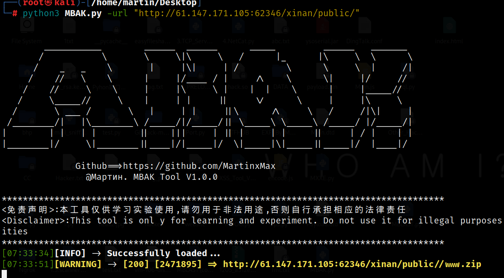

  <div align="center">
 <p align="center">
 
 
 
  
 
 
 </p>
  
  
   
 <table>
  <tr>
      <th>Function</th>
  </tr>
  <tr>
    <th>
        Backup file explosion
    </th>
    
  </tr>
 
 </table>
</div>

## usage method
  * View help information

      ```#python3 MSSRF.py -h```

    

# living example


    


```#python3 MSSRF.py -url "http://61.147.171.105:62346/xinan/public/55ceedfbc97b0a81277a55506c34af36.php?url=*" -info -exp```

    

 

